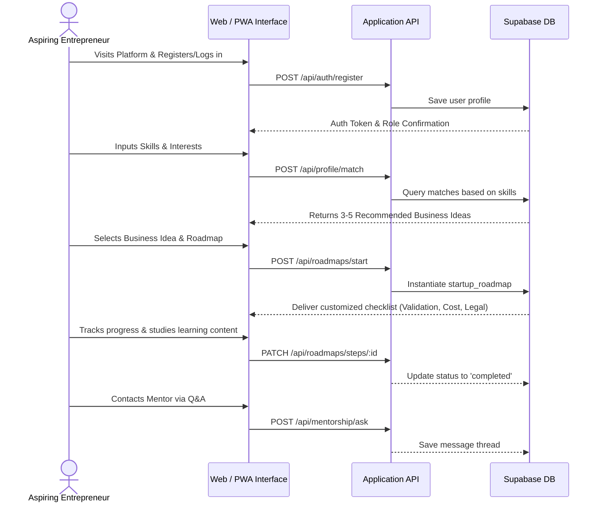

# EntreSkill Hub – Skill-to-Startup Platform Analysis

Aspiring micro-entrepreneurs face unique challenges when converting practical skills into sustainable businesses. The **EntreSkill Hub** is a digital platform designed to bridge this gap by providing structured business-ideation tools, step-by-step roadmaps, micro-learning resources, and community mentorship.

This document outlines the scope, functional and non-functional requirements, target audience profiles, technical architecture, database schemas, design guidelines, assumptions, KPIs, and deliverables.

---

## 1. Project Vision & Core Value Proposition

EntreSkill Hub aims to democratize micro-entrepreneurship by transforming scattered learning resources and complex business setup processes into a linear, guided journey.

### Strategic Objectives

#### Primary Objectives
*   **Skill-to-Business Discovery**: Help users discover viable business ideas directly aligned with their practical skills and interests.
*   **Structured Guidance**: Provide clear, step-by-step operational, legal, and financial roadmaps for starting a business.
*   **Accessible Education**: Offer beginner-friendly, byte-sized training modules and learning resources.
*   **Mentorship Support**: Facilitate access to guidance, support, and feedback from experienced mentors.

#### Secondary Objectives
*   **Self-Employment & Local Impact**: Promote self-employment and foster local entrepreneurship to strengthen community micro-economies.
*   **Inclusive Support**: Focus specifically on empowering women, youth, and rural entrepreneurs.
*   **Formalize Advice**: Reduce user dependency on fragmented or informal guidance by standardizing registration and startup steps.
*   **Scalable Ecosystem**: Create a highly scalable entrepreneurship enablement ecosystem that can adapt to different regions and industries.

---

## 2. Scope of Work

Determining boundaries for the initial release ensures a targeted and highly operational platform.

### In-Scope
*   **Web-based responsive platform**: Fully accessible via mobile, tablet, and desktop browsers.
*   **Skill and interest assessment**: Dynamic profiling tool mapping user parameters to business templates.
*   **Business idea recommendation engine**: Core system ranking ideas matching user profiles.
*   **Interactive roadmaps**: Dynamic checklists covering validation, legal, cost estimation, sourcing, and marketing.
*   **Micro-learning resources**: Media library (articles, videos, interactive checklists).
*   **Mentorship directory & Q&A portal**: Direct access to verified local mentors.
*   **Admin & Mentor Dashboards**: Moderation tools, session tracking, and content curation.

### Out of Scope
*   **Native mobile applications**: (Planned for future enhancement).
*   **Live funding or loan processing**: Platform will suggest costs and resources but will not handle financial transactions or loan distributions directly.
*   **Advanced AI career coaching**: The matchmaking logic will use standard profiling in Phase 1 (Advanced AI matching planned for Phase 2).
*   **Government subsidy integrations**: Guides will link to government portals but will not process filings automatically.

---

## 3. Target Audience Personas

| Persona | Skills | Key Challenges | Tech Literacy | Needs |
| :--- | :--- | :--- | :--- | :--- |
| **Mariam (The Home Tailor)** | Embroidery, sewing, clothing repair | No pricing strategy, doesn't know how to reach clients online, busy with child care. | Low (uses WhatsApp & YouTube primarily). | Simple UI, voice-assisted instructions, pricing calculators, localized legal advice. |
| **Rajesh (The Repair Technician)** | Mobile repairs, electronics servicing | Cash flow management, lacks capital, works informally. | Medium (uses smartphones, digital payments). | Bookkeeping helper, micro-credit linkages, official registration checklist. |
| **Elena (The Food Artisan)** | Traditional baking, local snacks | Compliance with food safety, sourcing raw materials cost-effectively. | Medium (uses social media for promotion). | Step-by-step hygiene registration checklist, supplier matching directories. |

---

## 4. Functional Requirements

### 4.1. User Features
*   **Registration & Login**: Secure sign-up/in with email or phone number. Role-based onboarding.
*   **Skill & Interest Profiling**: Input forms to specify practical skills (e.g., crafts, repair, food) and interests.
*   **Business Recommendations**: List of matching micro-business concepts.
*   **Bookmark & Save**: Ability to save ideas and compare different options.
*   **Access to Business Roadmaps**:
    *   *Validation*: Step-by-step instructions to verify local demand.
    *   *Skills & Tools*: Checklist of physical assets and training required.
    *   *Legal & Registration*: Information on regional licenses and micro-business registrations.
    *   *Cost Estimation*: Simple tools to list startup assets and calculate initial budget.
    *   *Marketing Basics*: Actionable steps to get the first 10 customers.
*   **Learning Resources**: Categorized index of articles, videos, and worksheets.
*   **Progress Dashboard**: Visual feedback on completed roadmap milestones and education courses.
*   **Connect with Mentors**: Request assistance via Q&A boards or schedule feedback sessions.

### 4.2. Mentor / Trainer Features
*   **Registration & Verification**: Onboarding portal with background detail submission for admin approval.
*   **Profile Management**: Showcase expertise areas, experience, availability, and background.
*   **Resource Upload**: Upload guidebooks, checklists, or videos to the learning directory.
*   **Q&A & Session Guidance**: Respond to user queries, host structured advice sessions, and review business canvases.
*   **Engagement Tracking**: Dashboard showing mentees supported and completion stats of guided roadmaps.

### 4.3. Admin Features
*   **User & Mentor Management**: Ability to activate, suspend, or verify accounts.
*   **Content Moderation**: Review and approve training uploads, Q&A logs, and community reports.
*   **Curation Engine**: Add, update, or remove business templates, roadmaps, and checklist steps.
*   **Platform Monitoring**: Visual dashboard tracking registration rates, engagement, and MFI/mentor activity.
*   **Feedback Handling**: Export data reports, address platform bug flags, and manage system complaints.

---

## 5. Non-Functional Requirements

*   **Performance**:
    *   Target page load time under **3 seconds** on standard mobile networks.
    *   Support high concurrent users and real-time mentor booking sessions.
*   **Security**:
    *   Secure authentication using JWT/OAuth.
    *   Role-Based Access Control (RBAC) ensuring separation of User, Mentor, and Admin environments.
    *   Encrypted storage of sensitive personal information.
*   **Accessibility**:
    *   Low-bandwidth optimization: Compressed images, lazy-loaded components, and offline capability via Service Workers.
    *   WCAG 2.1 AA Compliance: High contrast text, keyboard navigability, and clear focus states.
*   **Usability**:
    *   Intuitive layouts, large touch targets, minimal forms, and visual iconography.
*   **Scalability**:
    *   Modular architecture supporting rapid addition of new regional legal structures, skill types, and languages.

---

## 6. High-Level User Flow



---

## 7. Technology Stack

*   **Frontend**:
    *   **React.js / Next.js**: Component-based modular framework, utilizing Server Components for speed.
    *   **Tailwind CSS**: Utility-first CSS allowing custom responsive tokens and dark-mode options.
*   **Backend**:
    *   **Node.js with Express.js**: Fast, asynchronous REST API layer.
*   **Database**:
    *   **PostgreSQL / MongoDB**: Relational schemas for roadmap structures (PostgreSQL preferred for strict references, or MongoDB for unstructured learning modules).
*   **APIs**:
    *   REST endpoints secure-capped with JSON Web Tokens (JWT).
*   **Deployment**:
    *   **Vercel / Netlify**: Frontend deployment & Edge hosting.
    *   **AWS / Render / Supabase**: Database and Express API orchestration.

---

## 8. Data Requirements & Database Schema

### Core Entities & Relationships

```sql
-- Role Enumeration
CREATE TYPE user_role AS ENUM ('user', 'mentor', 'admin');
CREATE TYPE roadmap_status AS ENUM ('in_progress', 'completed', 'paused');
CREATE TYPE resource_type AS ENUM ('video', 'article', 'checklist');
CREATE TYPE session_status AS ENUM ('scheduled', 'completed', 'cancelled');

-- Users & Credentials
CREATE TABLE users (
    id UUID PRIMARY KEY DEFAULT gen_random_uuid(),
    email VARCHAR(255) UNIQUE NOT NULL,
    password_hash VARCHAR(255) NOT NULL,
    full_name VARCHAR(255) NOT NULL,
    phone_number VARCHAR(20),
    role user_role DEFAULT 'user',
    preferred_language VARCHAR(10) DEFAULT 'en',
    created_at TIMESTAMP WITH TIME ZONE DEFAULT CURRENT_TIMESTAMP,
    updated_at TIMESTAMP WITH TIME ZONE DEFAULT CURRENT_TIMESTAMP
);

-- Core Skills Listing
CREATE TABLE skills (
    id UUID PRIMARY KEY DEFAULT gen_random_uuid(),
    name VARCHAR(100) UNIQUE NOT NULL,
    category VARCHAR(100) NOT NULL
);

-- Core Interests Listing
CREATE TABLE interests (
    id UUID PRIMARY KEY DEFAULT gen_random_uuid(),
    name VARCHAR(100) UNIQUE NOT NULL,
    category VARCHAR(100) NOT NULL
);

-- Business Ideas Catalog
CREATE TABLE business_ideas (
    id UUID PRIMARY KEY DEFAULT gen_random_uuid(),
    title VARCHAR(255) NOT NULL,
    description TEXT NOT NULL,
    category VARCHAR(100) NOT NULL,
    estimated_startup_cost NUMERIC(12, 2) DEFAULT 0.00,
    created_at TIMESTAMP WITH TIME ZONE DEFAULT CURRENT_TIMESTAMP
);

-- Mapping required skills and interests to business ideas
CREATE TABLE business_idea_skills (
    business_idea_id UUID REFERENCES business_ideas(id) ON DELETE CASCADE,
    skill_id UUID REFERENCES skills(id) ON DELETE CASCADE,
    PRIMARY KEY (business_idea_id, skill_id)
);

CREATE TABLE business_idea_interests (
    business_idea_id UUID REFERENCES business_ideas(id) ON DELETE CASCADE,
    interest_id UUID REFERENCES interests(id) ON DELETE CASCADE,
    PRIMARY KEY (business_idea_id, interest_id)
);

-- User Profile Selections (Many-to-Many mapping)
CREATE TABLE user_skills (
    user_id UUID REFERENCES users(id) ON DELETE CASCADE,
    skill_id UUID REFERENCES skills(id) ON DELETE CASCADE,
    PRIMARY KEY (user_id, skill_id)
);

CREATE TABLE user_interests (
    user_id UUID REFERENCES users(id) ON DELETE CASCADE,
    interest_id UUID REFERENCES interests(id) ON DELETE CASCADE,
    PRIMARY KEY (user_id, interest_id)
);

-- Active User Roadmaps
CREATE TABLE startup_roadmaps (
    id UUID PRIMARY KEY DEFAULT gen_random_uuid(),
    user_id UUID REFERENCES users(id) ON DELETE CASCADE,
    business_idea_id UUID REFERENCES business_ideas(id) ON DELETE CASCADE,
    status roadmap_status DEFAULT 'in_progress',
    created_at TIMESTAMP WITH TIME ZONE DEFAULT CURRENT_TIMESTAMP,
    updated_at TIMESTAMP WITH TIME ZONE DEFAULT CURRENT_TIMESTAMP,
    CONSTRAINT unique_user_idea UNIQUE (user_id, business_idea_id)
);

-- Roadmap Steps
CREATE TABLE roadmap_steps (
    id UUID PRIMARY KEY DEFAULT gen_random_uuid(),
    business_idea_id UUID REFERENCES business_ideas(id) ON DELETE CASCADE,
    step_order INTEGER NOT NULL,
    title VARCHAR(255) NOT NULL,
    description TEXT NOT NULL,
    phase VARCHAR(50) NOT NULL, -- 'validation', 'skills_tools', 'legal', 'cost', 'marketing'
    action_url VARCHAR(512)
);

-- User Progress Tracking on Steps
CREATE TABLE user_step_progress (
    id UUID PRIMARY KEY DEFAULT gen_random_uuid(),
    user_id UUID REFERENCES users(id) ON DELETE CASCADE,
    roadmap_step_id UUID REFERENCES roadmap_steps(id) ON DELETE CASCADE,
    is_completed BOOLEAN DEFAULT FALSE,
    updated_at TIMESTAMP WITH TIME ZONE DEFAULT CURRENT_TIMESTAMP,
    CONSTRAINT unique_user_step UNIQUE (user_id, roadmap_step_id)
);

-- User Saved/Bookmarked Ideas
CREATE TABLE user_saved_ideas (
    user_id UUID REFERENCES users(id) ON DELETE CASCADE,
    business_idea_id UUID REFERENCES business_ideas(id) ON DELETE CASCADE,
    saved_at TIMESTAMP WITH TIME ZONE DEFAULT CURRENT_TIMESTAMP,
    PRIMARY KEY (user_id, business_idea_id)
);

-- Learning Resources
CREATE TABLE learning_resources (
    id UUID PRIMARY KEY DEFAULT gen_random_uuid(),
    roadmap_step_id UUID REFERENCES roadmap_steps(id) ON DELETE SET NULL,
    title VARCHAR(255) NOT NULL,
    content_type resource_type NOT NULL,
    content TEXT, -- Markdown content or URL path
    media_url VARCHAR(512),
    created_at TIMESTAMP WITH TIME ZONE DEFAULT CURRENT_TIMESTAMP
);

-- Mentor Profiles
CREATE TABLE mentors (
    id UUID PRIMARY KEY DEFAULT gen_random_uuid(),
    user_id UUID UNIQUE REFERENCES users(id) ON DELETE CASCADE,
    expertise VARCHAR(255)[] NOT NULL,
    experience_years INTEGER NOT NULL DEFAULT 0,
    bio TEXT,
    is_verified BOOLEAN DEFAULT FALSE,
    created_at TIMESTAMP WITH TIME ZONE DEFAULT CURRENT_TIMESTAMP
);

-- Mentor-Mentee Action Sessions
CREATE TABLE mentor_sessions (
    id UUID PRIMARY KEY DEFAULT gen_random_uuid(),
    mentor_id UUID REFERENCES mentors(id) ON DELETE CASCADE,
    user_id UUID REFERENCES users(id) ON DELETE CASCADE,
    session_time TIMESTAMP WITH TIME ZONE NOT NULL,
    status session_status DEFAULT 'scheduled',
    notes TEXT,
    created_at TIMESTAMP WITH TIME ZONE DEFAULT CURRENT_TIMESTAMP
);

-- Feedback Tracker
CREATE TABLE feedback (
    id UUID PRIMARY KEY DEFAULT gen_random_uuid(),
    user_id UUID REFERENCES users(id) ON DELETE SET NULL,
    rating INTEGER CHECK (rating BETWEEN 1 AND 5),
    comments TEXT,
    created_at TIMESTAMP WITH TIME ZONE DEFAULT CURRENT_TIMESTAMP
);
```

---

## 9. Assumptions, Constraints & KPIs

### Assumptions
*   Target users own or have access to a smartphone with stable/semi-stable mobile data.
*   Mentors sign up voluntarily or are sponsored by partner organizations (NGOs, community centers) to provide guidelines.
*   Business and licensing information is validated by regional legal volunteers.

### Constraints
*   **Phase 1 Limitations**: Real-time mentor availability might be restricted; asynchronous Q&A boards will serve as the fallback.
*   **Infrastructure**: Systems must be optimized for low-bandwidth cellular environments (e.g., using lightweight PWAs rather than heavy dynamic loads).
*   **Legal Scopes**: Specific legal templates will focus on a designated pilot area before regional expansion.

### Key Performance Indicators (KPIs)
1.  **User Onboarding Rate**: Total registered entrepreneurs per month.
2.  **Roadmap Progress Index**: Completion rate of registered business roadmap steps.
3.  **Engagement Depth**: Duration of users interaction with learning media.
4.  **Mentorship Connection Rate**: Percentage of users who submit queries or schedule feedback calls with verified mentors.
5.  **Satisfaction Score**: Net Promoter Score (NPS) collected via the built-in feedback module.

---

## 10. Deliverables

1.  **Functional Web Application**: Responsive frontend codebase (Next.js) fully integrated with backend APIs (Express/Node) and PostgreSQL database.
2.  **Role Dashboards**: Fully functioning User checklist tracking, Mentor resource publishing, and Admin moderation dashboards.
3.  **Technical Documentation**: Database migration files, detailed API specs, and PWA setup guidelines.
4.  **Deployment Configurations**: Prepared Docker, Vercel, or AWS Terraform files.

---

## 11. Expected Impact & Future Enhancements

### Impact
*   **Grassroots Empowerment**: Provides rural, youth, and female entrepreneurs direct tools to launch a registered local business.
*   **Structural De-Risking**: Direct budgeting helpers and market validation strategies lower early micro-business failure rates.
*   **Formalization**: Promotes shift from informal labor to registered enterprise structures.

### Future Roadmap (Post-MVP)
*   *AI matching extensions*: Automated analysis of regional trends to suggest high-performing businesses.
*   *Multi-language translation engine*: Integration of regional dialects and speech-assisted checklists.
*   *Financial linkups*: Direct API connection to local microfinance institutions (MFIs) for loan application tracking.
